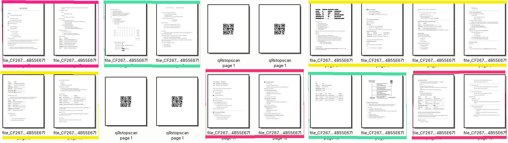

### Project Overview

This repository is designed to work with scanners that have an Automatic Document Feeder (ADF), such as the **Brother ADS-1300**.

When scanning documents in bulk, the scanner produces a single PDF containing all scanned pages. While PDF splitters can be used to separate documents, the process becomes more complex when multiple documents belong to the same group.

To solve this problem, **QR codes** are used as separators between document groups. This repository helps automate the process of splitting, OCR processing, and organizing scanned documents, streamlining the workflow.

---
### Workflow Overview

1. Scan documents in bulk using an ADF scanner
2. Insert a QR code page between document groups
3. Process the PDF automatically
4. Receive separated, OCR-processed, and renamed documents


## Step 1. Scan a Batch of Documents

Scan a batch of documents using the ADS-1300. The scanner will generate a single PDF containing all pages.

To separate document groups, add a page with a **QR code** between each group during scanning.

Example output:



The result is a PDF with 6 pages, stored in:

```
/report/archivo/batch.....
```

---

## Step 2. Create Python Virtual Environment

Create and activate a virtual environment, then install the required dependencies:

```bash
python3 -m venv .env
source .env/bin/activate
pip install -r requirements.txt
python -m spacy download en_core_web_sm
```

---

## Step 3. OCR Processing and File Renaming

Enable execution permissions for the scripts:

```bash
chmod +x calhash.sh
chmod +x renamefile-OCR.sh
chmod +x sep.sh
chmod +x renamefile_spacy.py
```

Create the required directories:

```bash
mkdir -p unify archive pdftopng pdfseparate report/archivo/skip report/consume .original/
```

Run the main process:

```bash
./sep.sh
```

You may see warnings like the following. These are normal when starting the process:

```bash
Clean Separate and PNG directory
rm: cannot remove './pdfseparate/*': No such file or directory
rm: cannot remove './pdftopng/*': No such file or directory
Setting up watches.
Watches established.
```

### Output Behavior

* All processed pages are saved in `/report/archivo/batch......`
* The original PDF is saved in `.original`
* If a duplicate file is detected, it is saved in `.original/duplicate` and processing for that file stops

---

## Dockerfile

Build the Docker image from the project directory:

```bash
docker build -t ocrdoc .
```

Create and run a container:

```bash
docker run -d \
  --name ocrapp9 \
  -v "$(pwd)/report/consume":/ocrapp/report/consume \
  -v "$(pwd)/report/archivo":/ocrapp/report/archivo \
  ocrdoc
```

View container logs with:

```bash
docker logs -f 9b38f......
```

You can create multiple containers (e.g. `ocrapp9`, `ocrapp10`, etc.) to process files for different users independently.

To process new documents, simply add files to:

```
/report/consume
```

The container will continue running and waiting for new documents.

---

```text
 _      __     _ __    ____ __
| | /| / /__ _(_) /_  / _(_) /__ ___
| |/ |/ / _ `/ / __/ / _/ / / -_|_-<
|__/|__/\_,_/_/\__/ /_//_/_/\__/___/
```

---

